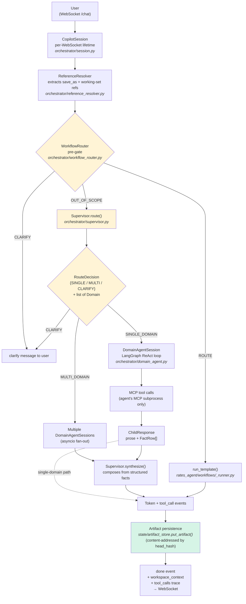
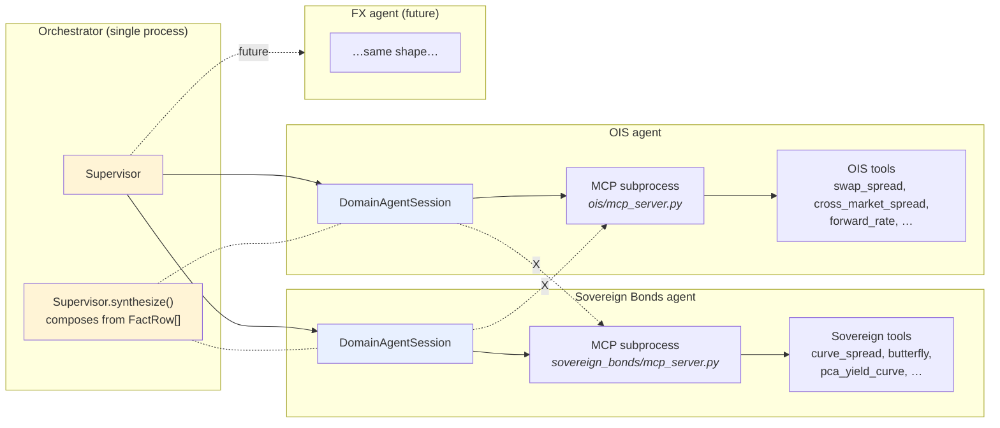

# Internal Architecture — Prompt to Answer

> How a user prompt routes from the WebSocket entry point through the orchestrator, the supervisor, the domain agents, and finally to the tools, operators, and workflow DAGs that produce the answer.

**Version:** v1.1
**Last reviewed:** 2026-05-16
**Scope:** the backend pipeline from `api/routes/chat.py` to the response envelope. Component-level deep dives (what a primitive *is*, what makes a valid operator, the artifact closed family, etc.) live in [`../02_components/`](../02_components/), not here.

---

## The 30-second view

Every chat message reaches the backend over a single per-session WebSocket. A pre-gate workflow router decides whether the prompt is a fixed-topology workflow request — if it is, execution skips the supervisor entirely and runs the template directly. If it is not, the supervisor classifies the prompt into one or more **single-domain** child agents (rates today; FX, credit, etc. in future), each running as a hard-isolated subprocess with only its own MCP-exposed tools. Cross-domain queries fan out to multiple child agents in parallel; the supervisor then composes from each child's *structured response payload* (facts plus the child's own `answer_markdown` — never raw streamed prose) into a single synthesised answer.

Persistence differs by route, and the difference is load-bearing:

- **Workflow route** (template matched) — terminal artifact, intermediate node artifacts, DAG topology, and a workspace handle are all persisted (content-addressed) before the `done` event. The event carries the workspace `slug` so the frontend's "Open in Build" CTA navigates to `/workspace/{slug}`.
- **Supervisor route** (template not matched) — workspace persistence is **not yet wired**. The `ToolTraceEntry` records only tool name, duration, and error — raw tool output is not retained, so there is nothing yet to materialise into a workspace artifact. The `done` event carries `workspace_context` (working-set metadata) but no slug; the frontend renders an inline answer card instead of opening a workspace. The persistence helper at [`orchestrator/supervisor_persistence.py`](../../orchestrator/supervisor_persistence.py) exists and is fully wired on its own — the missing piece is plumbing raw tool output through `ToolTraceEntry` → `ChildResponse.tool_trace`. Tracked as a follow-up.

## The full flow

**Two construction modes** share this pipeline:

- **Template route** (D → E): The user's prompt matches one of the registered workflow templates. The router binds slots, the executor runs the fixed DAG, the supervisor is never consulted.
- **Supervisor route** (D → F → G): The prompt does not match a registered template. The supervisor picks one or more domain agents; each agent's own LLM does ReAct-style tool selection from *its* MCP-exposed toolset.

**Workflow archetype status today** — the closed-family target is five archetypes, but only a subset is live-routable:

| Archetype | Status today | Where this lives |
|---|---|---|
| `event_study` | **Live, routable.** Imported by [`api/routes/workflows/catalogue.py`](../../api/routes/workflows/catalogue.py); registered with the substrate's template registry. | [`rates_agent/workflows/event_study/`](../../rates_agent/workflows/event_study/) |
| `regime_conditioned_relationship` | **Live, routable.** Imported by `catalogue.py`; registered. | [`rates_agent/workflows/regime_conditioned_relationship/`](../../rates_agent/workflows/regime_conditioned_relationship/) |
| `backtest` | **Implemented but paused from the LLM-facing surface.** Template + operators + tests live in the repo and run under the gauntlet; the import is deliberately commented out in [`rates_agent/workflows/mcp_server.py`](../../rates_agent/workflows/mcp_server.py) until the data substrate carries the fields needed for economically-meaningful P&L (mod-duration, dirty price, OTR history, true overnight OIS, bid/ask, CPI seasonal factors). | [`rates_agent/workflows/backtest/`](../../rates_agent/workflows/backtest/) |
| `attribution_decomposition` | **Not yet registered** (closed-family target). | — |
| `cross_sectional_screen` | **Not yet registered** (closed-family target). | — |

Adding any of the three not-live archetypes back is a closed-family-aware change per P8 (the archetype enum is `Literal[...]`-typed) and is therefore an ADR-gated decision, not a casual addition.

## Domain agents and hard isolation (P11)

Each domain agent is a sibling package (`rates_agent/`, future `fx_agent/`, etc.) with its own MCP server subprocess. The orchestrator's `DomainAgentSession` connects to *only* the subprocess of the domain the supervisor routed to.

The dashed `X` arrows are the enforced prohibition: a domain agent **cannot** call another domain's tools. Cross-domain composition happens only at the supervisor layer. The synthesis stage (`Supervisor.synthesize_stream` in [`orchestrator/supervisor.py`](../../orchestrator/supervisor.py)) consumes each child's *structured response payload* — a compact JSON dump that includes `status`, `facts` (the canonical numeric substrate), `answer_markdown` (the child's own structured answer), and `follow_up_question`. The synthesis does **not** stitch the raw token-streamed prose that each child emits during its ReAct loop; the substrate is the structured payload, and `facts` are the numeric backbone the synthesis is allowed to ground in. This is the operational expression of P11 in [`../00_thesis/01_non_negotiables.md`](../00_thesis/01_non_negotiables.md).

## Request lifecycle — the numbered steps

Concise reference; one line per step plus the file:function it lives in.

| # | Step | File : function |
|---|---|---|
| 1 | WebSocket connection opens, `CopilotSession` created | [`api/routes/chat.py`](../../api/routes/chat.py) : `copilot_chat()` |
| 2 | Per-session state initialised; checkpointer attached (Postgres if available, else Memory) | [`orchestrator/session.py`](../../orchestrator/session.py) : `CopilotSession.__init__()` |
| 3 | User message arrives → turn row inserted (`status=running`) | [`orchestrator/state.py`](../../orchestrator/state.py) : `begin_turn()` |
| 4 | Conversation history + visible working-set names loaded into routing prefix | `session.py` : `_load_recent_turns_if_possible()` + `working_set.list_visible()` |
| 5 | LLM call: extract `save_as` + `referenced_names` | [`orchestrator/reference_resolver.py`](../../orchestrator/reference_resolver.py) : `ReferenceResolver.resolve()` |
| 6 | Pre-gate: workflow-template router decides `ROUTE` / `OUT_OF_SCOPE` / `CLARIFY` | [`orchestrator/workflow_router.py`](../../orchestrator/workflow_router.py) : `WorkflowRouter.execute()` |
| 7a | If `ROUTE`: bind slots and execute the template DAG; supervisor is skipped | [`rates_agent/workflows/_runner.py`](../../rates_agent/workflows/_runner.py) : `run_template()` → [`shared/workflow/executor.py`](../../shared/workflow/executor.py) : `execute_workflow()` |
| 7b | If `OUT_OF_SCOPE`: supervisor LLM call → `RouteDecision(action, domains, rationale)` | [`orchestrator/supervisor.py`](../../orchestrator/supervisor.py) : `Supervisor.route()` |
| 8 | `SINGLE_DOMAIN`: one `DomainAgentSession.run()` — a LangGraph ReAct loop bound to that domain's MCP toolset | [`orchestrator/domain_agent.py`](../../orchestrator/domain_agent.py) : `DomainAgentSession.run()` |
| 8' | `MULTI_DOMAIN`: same `DomainAgentSession.run()` called in parallel for each routed domain | `session.py` : multi-domain branch |
| 9 | Each tool call: MCP request → primitive `compute()` → typed `Series` artifact via `tool_output_to_artifact_series()` | [`rates_agent/{domain}/mcp_server.py`](../../rates_agent/) → [`shared/artifacts/adapters/from_time_series.py`](../../shared/artifacts/adapters/from_time_series.py) |
| 10 | Multi-domain only: supervisor composes from each child's structured payload (`status` + `facts` + `answer_markdown` + `follow_up_question`); streams synthesis tokens | `supervisor.py` : `Supervisor.synthesize_stream()` |
| 11 | **Workflow route:** terminal + intermediate artifacts persisted, DAG topology persisted, workspace handle minted (slug returned on `done`). **Supervisor route:** persistence not yet wired — tool trace recorded but raw tool output discarded, so no artifact/workspace materialises today (the helper exists but the upstream plumbing does not) | [`state/artifact_store.py`](../../state/artifact_store.py) : `put_artifact()`; [`state/workspace_repo.py`](../../state/workspace_repo.py) ; [`orchestrator/supervisor_persistence.py`](../../orchestrator/supervisor_persistence.py) (unwired) |
| 12 | Turn committed (`status=completed`, terminal artifact stamped); `done` event sent with `workspace_context` + `tool_calls` trace | `state.py` : `commit_turn()` + `events.py` : `done` event |

## What each major component is responsible for

Brief descriptions; deeper contracts live in [`../02_components/`](../02_components/).

- **CopilotSession** ([`orchestrator/session.py`](../../orchestrator/session.py)) — owns one WebSocket; runs the turn loop; holds the checkpointer; coordinates Reference Resolver → Workflow Router → Supervisor → child agents → persistence → events.
- **Reference Resolver** ([`orchestrator/reference_resolver.py`](../../orchestrator/reference_resolver.py)) — single LLM call that decides which prior named artifacts the user is referencing (`referenced_names`) and what name (if any) to save the new terminal artifact under (`save_as`). Augments the routing prompt; commits to working-set on success.
- **Workflow Router** ([`orchestrator/workflow_router.py`](../../orchestrator/workflow_router.py)) — pre-gate that matches the prompt against the five closed-family archetypes. If matched, the template runs directly and the supervisor never sees the prompt. Returns `WorkflowRouteDecision(action, template_id, slot_values, rationale)`.
- **Supervisor** ([`orchestrator/supervisor.py`](../../orchestrator/supervisor.py)) — second-stage routing for everything that is *not* a template. Returns `RouteDecision(action, domains, rationale)` over the `Domain` enum. Also owns `synthesize()` — the multi-domain composition layer.
- **DomainAgentSession** ([`orchestrator/domain_agent.py`](../../orchestrator/domain_agent.py)) — opens a LangGraph ReAct loop bound to *exactly one* domain's MCP toolset (via `MultiServerMCPClient`). Emits `tool_call` / `tool_result` / `token` events as it runs. Returns `ChildResponse(prose, FactRow[])`.
- **MCP server** ([`rates_agent/{domain}/mcp_server.py`](../../rates_agent/)) — FastMCP subprocess; one per domain. Wraps each primitive call: Pydantic validation → primitive `compute()` → returned dict (or typed error envelope at this boundary per P6).
- **Workflow Executor** ([`shared/workflow/executor.py`](../../shared/workflow/executor.py)) — topologically sorts a workflow DAG, calls primitives via the `PrimitiveResolver`, calls operators via the `OPERATOR_REGISTRY`, threads lineage through every node, returns `WorkflowResult(terminal_artifact, lineage_summary, all_node_artifacts)`.
- **Artifact Store** ([`state/artifact_store.py`](../../state/artifact_store.py)) — `put_artifact(artifact, conn, object_storage) → head_hash`. Idempotent on `head_hash`. Inline vs. object-storage decided by row/byte threshold.
- **Override Classifier** ([`orchestrator/override_classifier.py`](../../orchestrator/override_classifier.py)) — post-`done` heuristic + optional LLM that detects workspace-mutation intent (e.g., *"change window to 30d"*) and stamps `ProposedOverride[]` on the event for the UI to render.
- **Events** ([`orchestrator/events.py`](../../orchestrator/events.py)) — the streaming envelope contract. Closed-family event types: `status`, `route_decision`, `child_started`, `child_finished`, `tool_call`, `tool_result`, `token`, `workflow_route_decision`, `workflow_status`, `workflow_result`, `done`.

## State and persistence

Five durable stores live in [`state/`](../../state/) and Postgres (schema: `copilot_state`). Brief; the full schema reference is forthcoming in `07_state_and_persistence.md`.

- **Artifact metadata + payload** — `copilot_state.artifact_metadata`; inline JSONB or object-storage URI based on size.
- **DAG topology** — three normalised tables (`copilot_state.dags`, `copilot_state.dag_nodes`, `copilot_state.dag_edges`), all content-addressed by `dag_hash`. The JSONB `topology` column on `dags` carries the full shape; the normalised tables exist alongside it to keep SQL queries tractable.
- **Workspace** — URL-addressable handles. Slug formula: `slugify(name) + "-" + uuid.hex[:8]` — derived once at create time and immutable; `rename_workspace` mutates the display name only. Unnamed workspaces fall back to `ws-{hex8}`. See [`state/workspace_repo.py`](../../state/workspace_repo.py).
- **Sessions / turns / working_set** — multi-turn conversation, append-mostly.
- **Methodology versions + application version** — version registries that pin replay (P4).
- **LangGraph checkpoint** — separate schema; LangGraph-owned; `AsyncPostgresSaver` if a pool is available, else `MemorySaver`.

## What is NOT in this doc

This is a flow doc. The following live elsewhere and are deliberately not duplicated here:

- **What makes a valid primitive / operator / workflow template / artifact** → [`../02_components/`](../02_components/) (one folder per component type).
- **The L1 data substrate** (playbooks, ingestion, instrument_master, time_series) → `01_l1_data_substrate.md` (forthcoming).
- **The lineage / replay model** (the four pins, `head_hash`, hash invariants) → `08_replay_and_versioning.md` (forthcoming).
- **The methodology-source taxonomy** (P5 enforcement at the convention layer) → `../04_standards/methodology_disclosure.md` (forthcoming).
- **State schema details** (tables, columns, indexes) → `07_state_and_persistence.md` (forthcoming).
- **Domain agent contracts** (sibling-pattern, MCP server requirements, registry shape) → [`../02_components/orchestration/`](../02_components/orchestration/) (forthcoming).
- **External UI surfaces** (pages, components, widget rendering) → [`01_external_architecture.md`](01_external_architecture.md).

## Version log

| Version | Date | Change | ADR |
|---|---|---|---|
| v1.1 | 2026-05-16 | Six factual corrections found in pre-canonical review (every claim re-verified against the source files cited): (a) **30-second view** — persistence claim split by route: workflow route persists artifacts + DAG + workspace (slug returned on `done`); supervisor route does not yet persist (raw tool output is discarded at `ToolTraceEntry` so the persistence helper at `supervisor_persistence.py` has nothing to materialise — tracked as a follow-up). (b) **Workflow archetype status** — replaced the claim that all five archetypes are live with an explicit status table: `event_study` + `regime_conditioned_relationship` live and registered; `backtest` implemented but paused from the LLM surface pending data substrate fields (mod-duration, dirty price, OTR history, true overnight OIS, bid/ask, CPI seasonals); `attribution_decomposition` and `cross_sectional_screen` not yet registered. (c) **Synthesis precision** — corrected the "never prose" claim: synthesis consumes the structured response payload (`status` + `facts` + `answer_markdown` + `follow_up_question`) and does not stitch raw token-streamed prose; facts are the numeric backbone. (d) **Lifecycle table step 11** — same persistence split applied. (e) **State and persistence** — corrected DAG table names (`copilot_state.dags` / `dag_nodes` / `dag_edges`, three normalised tables alongside the `topology` JSONB column — not `workflow_dag` singular); corrected slug formula to include the hyphen separator (`slugify(name) + "-" + uuid.hex[:8]`) and noted the unnamed fallback `ws-{hex8}`. | (pending) |
| v1 | 2026-05-16 | Initial internal-architecture doc. Replaced by v1.1 the same day after a factual-review pass. | — |
