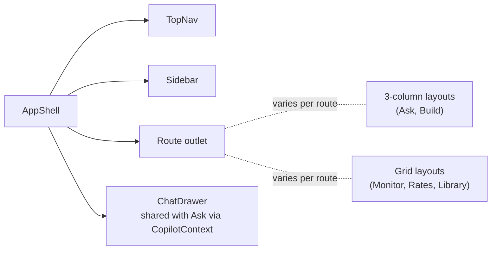
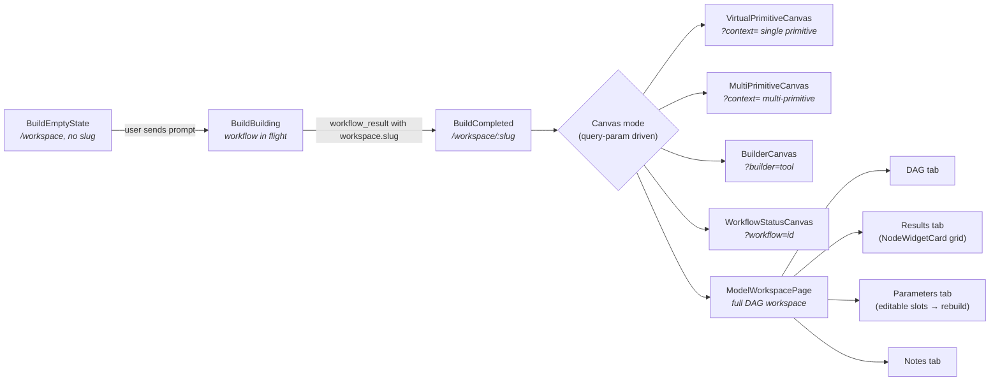
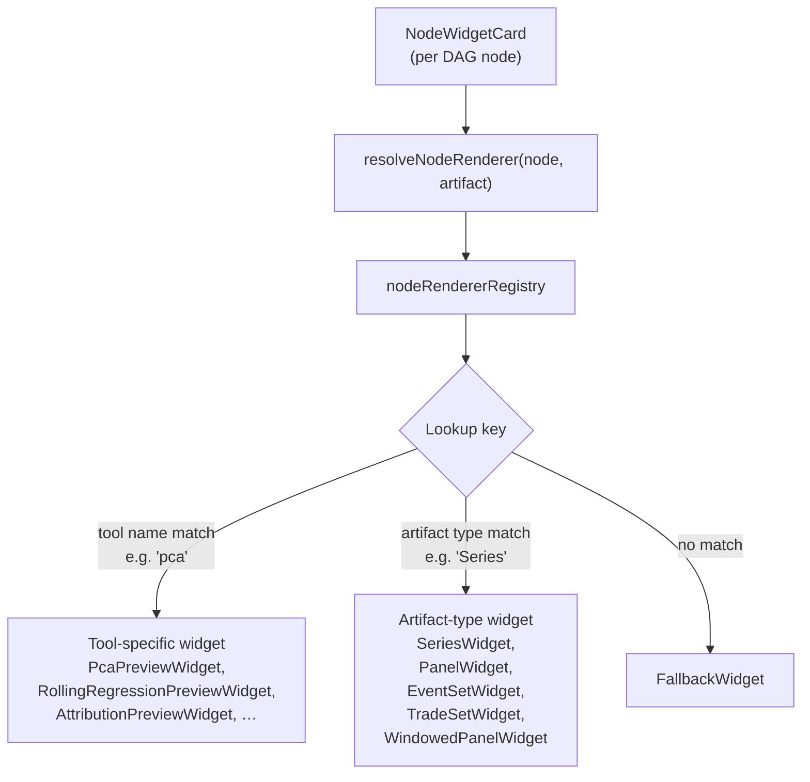

# External Architecture — UI Surfaces

> Map of every page in the Macro Copilot frontend, what each surface does, how it talks to the backend, and where shared state and rendering logic live.

**Version:** v1.1
**Last reviewed:** 2026-05-16
**Scope:** the React frontend at [`../../UI/macro-copilot-dashboard-polished/`](../../UI/macro-copilot-dashboard-polished/). Component-internal contracts (e.g., what a widget renderer must satisfy) live in [`../02_components/`](../02_components/), not here.

---

## The 30-second view

The frontend is a single React app served at one origin. Six top-level surfaces are live (**Monitor**, **Rates Agent**, **Workspace / Build**, **Ask**, **Library**, **Workflows** legacy), and five are placeholder shells for future agent surfaces (FX, Credit, Macro Equity, Policy Events, PM Orchestrator) plus a **Briefcase** placeholder. All conversational pages share a single `CopilotContext` so the Ask page and the sidebar chat drawer use the same WebSocket and message buffer. The Workspace / Build page is a small state machine with multiple canvas modes that share one shell. Per-node artifact rendering is dispatched through a single registry (`nodeRendererRegistry`) keyed by artifact type or tool name.

## Top-level shell

`AppShell` selects layout chrome by route. Sidebar-driven pages get a chat drawer rail; Ask and Build own their own full-width 3-column layouts and suppress the drawer.

## Page map

| URL | Component file | Purpose (one sentence) | API routes called | Status |
|---|---|---|---|---|
| `/` | [`MonitorPage.tsx`](../../UI/macro-copilot-dashboard-polished/src/components/monitor/MonitorPage.tsx) | Home dashboard of pre-configured rates widgets (yield snapshot, scanner, spreads, regime, curves). | `GET /api/v1/rates/yield-snapshot`, `GET /api/v1/rates/curve-shapes`, `GET /api/v1/rates/scanner`, `GET /api/v1/rates/cross-market`, `GET /api/v1/rates/regimes` | live |
| `/rates` | [`RatesAgentPage.tsx`](../../UI/macro-copilot-dashboard-polished/src/components/agents/) | Rates-focused agent page with sovereign-bonds + OIS widgets; same engine as Monitor with a rates-specific default layout. | same `/api/v1/rates/*` set as Monitor | live |
| `/fx`, `/credit`, `/macro-equity`, `/policy`, `/pm-orchestrator` | `AgentPlaceholderPage.tsx` | Placeholder for future agent surfaces. | none | placeholder |
| `/ask` | [`AskPage.tsx`](../../UI/macro-copilot-dashboard-polished/src/components/ask/) | Conversational multi-turn analysis interface with thread history and context rail. | **WebSocket** `ws://…/api/chat` (via `CopilotContext` / `useCopilot`) | live |
| `/workspace` | [`BuildShell.tsx`](../../UI/macro-copilot-dashboard-polished/src/components/build/) | Empty-state builder; user prompts → workflow runs over the chat WebSocket → on `done` with a slug, redirects to `/workspace/:slug`. Workspace creation is **not** a dedicated POST from Build; it is a side-effect of the workflow route's persistence step (`POST /api/v1/workspace` exists as the lower-level handle but Build does not call it directly). | none direct (chat WebSocket; workspace materialises server-side) | live |
| `/workspace/:slug` | [`BuildShell.tsx`](../../UI/macro-copilot-dashboard-polished/src/components/build/) | Completed workspace viewer: DAG + results + parameters + notes, with read-only copilot rail. | `GET /api/v1/workspace/{slug}`, `GET /api/v1/artifacts/{hash}/payload` | live |
| `/library` | [`LibraryPage.tsx`](../../UI/macro-copilot-dashboard-polished/src/components/library/) | Tool catalogue with agent / instrument / category / search filters; drawer-style detail view. | `GET /api/v1/library/manifest` | live |
| `/workflows` | `WorkflowsCataloguePage.tsx` | Legacy 3-column workflows catalogue; kept until the redesign ships. | `GET /api/v1/workflows`, `GET /api/v1/workflows/{template_id}` | legacy |
| `/briefcase` | `BriefcasePlaceholder.tsx` | Placeholder for V2 saved-analyses surface (pinned monitors, exported research notes). | none | placeholder |

## Surfaces in detail

Brief descriptions per live surface; component-level contracts live in `02_components/` (forthcoming).

### Monitor (`/`) and Rates Agent (`/rates`)

A configurable widget grid backed by `RatesDataProvider`. Layout is persisted to `localStorage` via `useWidgetLayout`. Widgets are registered in the monitor widget registry (separate from the Build-page renderer registry) and render pre-aggregated rates snapshots — yields, scanners, curve shapes, regime classifications — not full lineage-bearing artifacts.

### Ask (`/ask`)

Three-column layout:

- **Left** — `ThreadsRail`: list of conversation threads (currently a single thread derived from the messages buffer).
- **Centre** — `ConversationCanvas`: empty state or turn-by-turn conversation with message rendering, edit affordances, follow-ups.
- **Right** — `ContextRail`: pinned and inferred context cards (working-set artifacts and recently-referenced items).
- **Bottom** — `Composer`: pinned input ref-driven by the empty state, follow-ups, action rows, and `/workspace` *"rerun with"* links.

State is owned by `CopilotContext` (a singleton provider). The sidebar `ChatDrawer` on sidebar-routed pages shares the same context, so Ask and the drawer use one WebSocket and one message buffer.

### Workspace / Build (`/workspace`, `/workspace/:slug`)

A small state machine over one shell:

The completed `BuildCompleted` view is a three-column layout: persistent sidebar | canvas | read-only copilot rail (`WorkspaceCopilotRail`). Slot edits in the Parameters tab trigger a workflow re-bind that the backend persists as a new workspace variant (max three visible variants per the design under P5 disclosure).

### Library (`/library`)

A four-level taxonomy over the tool manifest:

- **Top tabs**: Primitives | Workflows | Operators (future).
- **Agent strip**: live Rates Agent + dimmed placeholders (FX, Credit, etc.).
- **Instrument strip**: All | Sovereign Bonds | OIS (from the manifest's instrument list).
- **Category chips**: functional groupings from `manifest.category_counts`.
- **Search**: free-text across `name`, `one_liner`, `related_tools`, `workflows`.
- **Grid**: `ToolCardGrid` of filtered tools; clicking a tool opens `ToolDetailDrawer`.

All filtering is client-side over the one manifest payload.

### Workflows (`/workflows`) and Briefcase (`/briefcase`)

`/workflows` is the legacy three-column catalogue retained until the redesign ships. `/briefcase` is a placeholder for the V2 saved-analyses surface (pinned monitors, exported research notes).

## Widget rendering dispatch

The Build page renders each DAG node's artifact through a single dispatcher.

Tool-specific overrides win over artifact-type defaults. The registry lives at [`src/components/build/lib/nodeRendererRegistry.ts`](../../UI/macro-copilot-dashboard-polished/src/components/build/lib/nodeRendererRegistry.ts); widgets are registered from `src/components/build/widgets/`.

## Component folders

| Folder | Role |
|---|---|
| `layout/` | `AppShell`, `TopNav`, `Sidebar`, `ChatDrawer` — top-level chrome. |
| `ask/` | Ask page parts: `ConversationCanvas`, `ThreadsRail`, `ContextRail`, `Composer`, message renderers. |
| `build/` | `BuildShell` + canvas variants + `ModelWorkspacePage` + DAG renderer + results grid + parameter editor. |
| `build/widgets/` | Artifact renderers and tool-specific previews dispatched via `nodeRendererRegistry`. |
| `monitor/` | `MonitorPage`, `WidgetGrid`, monitor widget registry, `RatesDataProvider`. |
| `library/` | Tool catalogue UI: tabs, strips, chips, search, grid, detail drawer. |
| `agents/` | Per-agent shells: `RatesAgentPage`, placeholder stubs for FX / Credit / Macro / Policy / PM. |
| `copilot/` | Build page's read-only chat rail (`WorkspaceCopilotRail`). |
| `catalogue/` | Legacy workflows catalogue. |
| `ui/` | Shared primitives: widget cards, icons, headers. |

## State and services

**Context.**
- `CopilotContext` (`src/context/CopilotContext.tsx`) — singleton provider wrapping `useCopilot()` so Ask and the sidebar `ChatDrawer` share one WebSocket and one message buffer. Exposes `messages`, `sendMessage`, `editAndResubmit`, `connectionStatus`, `isThinking`, `clearMessages`.
- `WorkspaceOverridesProvider` (mounted in `BuildShell`) — per-workspace UI state (edit mode, focused node, etc.).

**Hooks.**
- `useCopilot` — opens the WebSocket to `ws://…/api/chat` and owns the message buffer + connection lifecycle.
- `useThreads` — derives threads from the messages buffer.
- `useWorkspaceDetail` — `GET /api/v1/workspace/{slug}` → DAG + node + artifact summaries.
- `useArtifactPayload` — `GET /api/v1/artifacts/{hash}/payload` → deserialised artifact for rendering.
- `useLibraryManifest` — `GET /api/v1/library/manifest`.
- `useRatesData` — fans out to the per-card rates endpoints (`/yield-snapshot`, `/curve-shapes`, `/scanner`, `/cross-market`, `/regimes`) under `/api/v1/rates/`.
- `useWorkflows` — `GET /api/v1/workflows` (catalogue) and `GET /api/v1/workflows/{template_id}` (single card).
- `useWidgetLayout` — `localStorage`-backed widget grid state for Monitor / Rates pages.

**Services** (thin API clients in `src/services/`):
- `workspaceApi.ts`, `libraryApi.ts`, `ratesApi.ts`, `workflowsApi.ts` — one file per backend route group.

## What is NOT in this doc

- **What a widget contract looks like** (mandatory props, lifecycle, error states) → `../02_components/` (forthcoming).
- **What renders inside Build's DAG tab** at the node level → `../02_components/workspace/` (forthcoming).
- **Widget registry extension policy** (how to add a new widget) → `../03_runbooks/` (forthcoming).
- **The API route contract surface** (request/response shapes per endpoint) → `02_api_contract.md` (forthcoming).
- **The backend orchestration that produces the data these surfaces render** → [`00_internal_architecture.md`](00_internal_architecture.md).

## Version log

| Version | Date | Change | ADR |
|---|---|---|---|
| v1.1 | 2026-05-16 | Pre-canonical factual corrections, re-verified against the source files cited: (a) **Page-map API columns** — replaced four wrong-or-imagined routes with the real ones. Monitor + Rates: the five per-card endpoints (`/yield-snapshot`, `/curve-shapes`, `/scanner`, `/cross-market`, `/regimes`) under `/api/v1/rates/`, not a single `/rates/data`. Ask: WebSocket `ws://…/api/chat` (mounted at `/api` prefix, not `/api/v1`), not a `POST /api/v1/chat/message`. Workspace `/workspace`: no `POST /workspace/build` endpoint exists — the workspace is materialised server-side by the workflow route's persistence step, and the lower-level `POST /api/v1/workspace` handle is not called directly from Build. Workflows: `GET /api/v1/workflows` (catalogue) + `GET /api/v1/workflows/{template_id}` (single card), not `/workflows/catalogue`. (b) **`nodeRendererRegistry` location** — corrected from `src/lib/` to `src/components/build/lib/` (verified by file search). (c) **Hooks section** — `useRatesData` documented as fanning out across the per-card endpoints; `useWorkflows` split into the catalogue + single-card calls; `useCopilot` clarified as the WebSocket-owning hook. | (pending) |
| v1 | 2026-05-16 | Initial external-architecture doc. Replaced by v1.1 the same day after a factual-review pass. | — |
